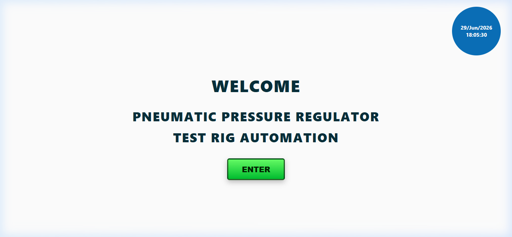
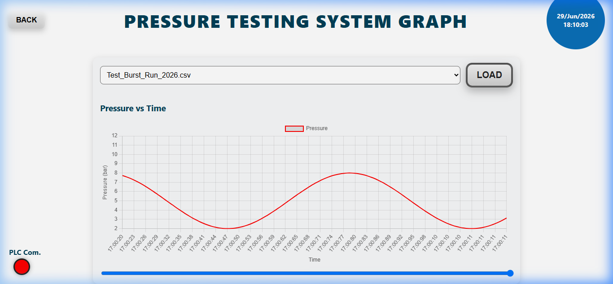

# 🏭 Industrial PLC Data Logger & SCADA Dashboard

> A real-time industrial telemetry system built with **FastAPI**, **Modbus TCP**, and a custom **HTML/JS frontend** — deployed across live pneumatic pressure test rigs integrated with **Siemens**, **Delta**, and **Mitsubishi** PLCs.

---

## 📌 Project Overview

This is a production-deployed SCADA-lite automation system designed for industrial **Pneumatic Pressure Regulator Test Rig** environments. It replaces manual monitoring with a real-time HMI (Human-Machine Interface) that communicates directly with PLCs over **Modbus TCP**, logs sensor data to structured CSV files, and presents live telemetry through an interactive web dashboard wrapped in a native desktop application via **PyWebView**.

The system has been actively used in industrial testing workflows for:

- **Burst pressure testing** — recording and displaying peak burst pressures under controlled ramp conditions
- **Impulse cycle testing** — monitoring high-frequency min/max pressure cycling with configurable limits
- **Multi-stage test sequencing** — up to 8 configurable test stages with individual pressure, rate, dwell, and cycle parameters

---

## 🔌 PLC Compatibility

The system communicates over **Modbus TCP (Port 502)** and has been integrated with three major industrial PLC families:

| Manufacturer | Series | Interface |
|---|---|---|
| **Siemens** | S7-1200 / S7-1500 | Modbus TCP Server (native or via CM module) |
| **Delta** | DVP / AS / AH Series | Modbus TCP built-in or via adapter |
| **Mitsubishi** | FX / Q / L Series | Modbus TCP via communication module |

Register addressing, float encoding (IEEE-754, big-endian word order), and UINT32 handling are all implemented to handle real-world PLC memory map differences across these platforms.

---

## 🛠️ Tech Stack

**Backend**
- `FastAPI` — REST API server powering all PLC read/write and data endpoints
- `pymodbus` — Modbus TCP client for PLC communication (float, UINT16, UINT32 registers)
- `Python threading` — concurrent background PLC polling loops with `threading.Lock` for thread-safe register access
- `CSV logging` — structured timestamped telemetry logs at 50ms intervals

**Frontend**
- `HTML5 / CSS3 / Vanilla JavaScript` — custom-built HMI screens, no frontend framework dependencies
- `Chart.js` — real-time pressure-vs-time line graphs with auto-scaling Y-axis
- `REST API polling` — frontend fetches `/plc_value` every 200ms for live display updates
- `Jinja2` — server-side HTML templating for all HMI screen routes

**Desktop Wrapper**
- `PyWebView` — wraps the FastAPI web server in a native borderless desktop window for standalone HMI deployment

---

## 🌟 Key Features

### Real-Time PLC Monitoring
Background threads continuously poll Modbus TCP registers for the active test page, reading float (IEEE-754), UINT32, and UINT16 registers and serving them through a `/plc_value` REST endpoint consumed by the frontend every 200ms.

### Multi-Mode Test Automation
Three fully automated test profiles, each with dedicated start/stop/pause controls written directly to PLC coil registers:
- **Burst Auto** — pressure ramp to burst with peak capture
- **Impulse Auto** — configurable min/max pressure cycling with dwell and cycle counters
- **Stage Auto** — up to 8 sequential test stages, each with independent pressure, rate, dwell, and cycle settings

### Parameter Write-Back
Operators can edit test recipe parameters directly from the HMI. Values are written back to PLC holding registers in real time via POST endpoints (`/write_burst_value`, `/write_impulse1_value`, `/write_stage_value`), supporting float, UINT32, and UINT16 types with correct Siemens word-order encoding.

### Automatic CSV Telemetry Logging
A dedicated `CSVManager` class runs a separate background thread logging live sensor values at 50ms resolution. Logs are automatically timestamped and saved to the `logs/` directory when a test starts, and closed when a test completes or is stopped.

### Historical Graph Analysis
Operators can reload any past test session from a dropdown list of saved CSV files and scroll through the full pressure-time graph — useful for post-test analysis and QC reporting.

### Built-in Simulation Mode
When no PLC is connected, the system generates realistic sine-wave pressure data with configurable setpoints, enabling safe offline demonstration, training, and UI development without physical hardware.

### Auto-Reconnect
A background reconnect thread monitors the PLC connection state and automatically retries on disconnection every 2 seconds, ensuring minimal downtime during network interruptions.

---

## 📸 Application Interface

### Welcome Screen


### Main Navigation Dashboard


### Live Burst Test — Real-Time Graph


### Historical Graph Analysis


---

## 📂 Project Structure

```
plc-data-logger/
├── app.py                      # Core FastAPI app, PLC polling threads, REST endpoints
├── Doc/
│   └── Images/                 # UI screenshots used in documentation
│       ├── burst_auto.png
│       ├── dashboard.png
│       ├── graph.png
│       └── welcome.png
├── logs/                       # Auto-generated timestamped CSV telemetry files
├── static/
│   └── js/
│       └── chart.umd.min.js    # Chart.js for live graph rendering
└── templates/                  # Jinja2 HTML templates for all HMI screens
    ├── welcome.html
    ├── main.html
    ├── burst_auto.html
    ├── burst_edit.html
    ├── impluse_1_auto.html
    ├── impluse_1_edit.html
    ├── stage_auto.html
    ├── stage_edit.html
    ├── manual.html
    ├── graph.html
    └── edit_program.html
```

---

## 🔗 API Endpoints (Selected)

| Method | Endpoint | Description |
|---|---|---|
| `GET` | `/plc_value` | Returns all current register values for the active page |
| `GET` | `/set_page/{page}` | Switches active polling context to the specified HMI page |
| `GET` | `/indicator_plc` | Returns PLC connection status indicator state |
| `POST` | `/burst_start` | Writes START command to PLC burst test coil |
| `POST` | `/burst_stop` | Writes STOP command to PLC burst test coil |
| `POST` | `/burst_pause` | Toggles PAUSE state on PLC burst test coil |
| `POST` | `/write_burst_value` | Writes a recipe parameter (float/int) to a PLC holding register |
| `POST` | `/write_stage_value` | Writes stage recipe parameters (pressure, rate, dwell, cycles) |
| `POST` | `/csv_start/{page}` | Starts CSV telemetry logging for the active test page |
| `POST` | `/csv_stop` | Stops and closes the active CSV log file |
| `GET` | `/csv_list` | Returns a list of all saved log files |
| `GET` | `/csv_data/{filename}` | Returns timestamp + pressure data arrays for historical graph |
| `GET` | `/graph_data/{page}` | Returns the latest live pressure value for graph streaming |
| `POST` | `/set_device_ip` | Connects to a PLC at the given IP address over Modbus TCP |

---

## 📝 License

This project is licensed under the **MIT License**.
