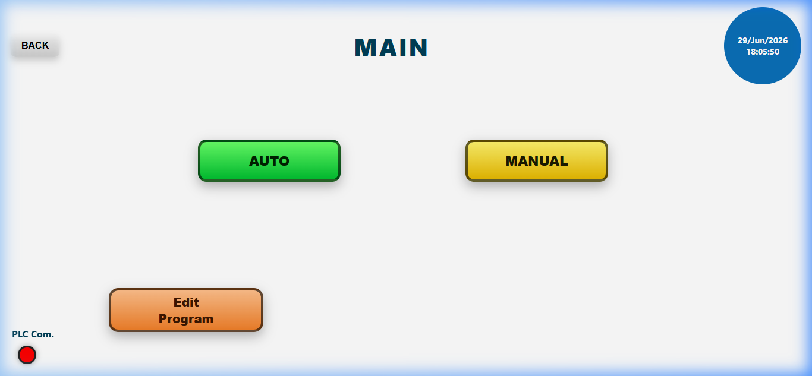
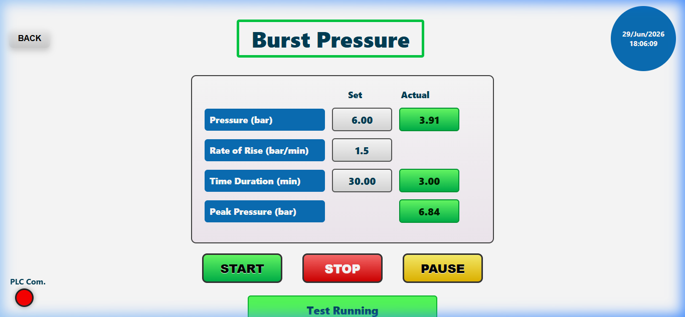

# Industrial PLC Data Logger & Dashboard

A lightweight, high-performance SCADA-lite telemetry collector and web dashboard built using **FastAPI** (Python backend), **Chart.js** (frontend rendering), and **Modbus TCP** (industrial PLC interface). It provides operators with real-time test monitoring, custom recipe parameter writers, and thread-safe CSV logging for specialized industrial testing procedures.

---

## 🔌 PLC Connectivity

The software connects over **Modbus TCP** and is engineered to interact with leading industrial Programmable Logic Controllers (PLCs):

*   **Siemens PLCs** (S7-1200 / S7-1500 series with Modbus TCP server enabled)
*   **Delta PLCs** (DVP / AS / AH series Modbus TCP interfaces)
*   **Mitsubishi PLCs** (FX / Q / L series via Modbus TCP communication modules)

By specifying the PLC IP address in the application's interface, the dashboard establishes a TCP connection (default port `502`, slave ID `1`) to poll data and write parameters.

---

## 🌟 Key Features

1.  **Multiple Testing Profiles**:
    *   **Burst Testing**: Record and display peak burst pressures.
    *   **Impulse Testing**: Monitor high-frequency min/max cycling limits.
    *   **Stage Testing**: Multi-stage (up to 8 steps) custom test configurations.
    *   **Manual Control**: Adjust limits and monitor live values interactively.
2.  **Live Telemetry Plotting**: Real-time line graphs powered by Chart.js (with auto-scaling y-axes).
3.  **Built-in Data Simulation**: Automatically generates simulated sine-wave data when disconnected from a physical PLC, enabling safe offline testing and training.
4.  **CSV Logging**: Automatically logs test parameters and live sensor readings to structured files in the `logs/` directory.
5.  **Historical Analysis**: Reload any logged test session CSV file from the UI to display and scroll through the historical graph.
6.  **PyWebView Desktop App Interface**: Runs a clean native desktop window wrapper for a standalone industrial HMI experience.

---

## 📸 Software Interface

Here are samples of the running application interface (captured during active simulation mode):

### 1. Welcome Screen
A clean splash screen prompting the operator to launch the interface.


### 2. Main Navigation Dashboard
The main control hub to navigate auto testing profiles (Burst, Impulse, Stage), manual control, program editing, and graph logs.


### 3. Live Burst Test Auto Screen (Active Graph)
A live rendering of the dynamic Modbus TCP pressure sensor data feeding into a real-time Chart.js graph.


### 4. Historical Graph Analysis Page
Select any past logged test file from the dropdown to load and scroll through historical data.


---

## 🛠️ Installation & Setup

### Prerequisites
*   Python 3.8+ (tested on Python 3.14)
*   Network connection to the target PLC (or runs offline using built-in simulation)

### 1. Clone the Repository
```bash
git clone https://github.com/your-username/plc-data-logger.git
cd plc-data-logger
```

### 2. Install Dependencies
```bash
pip install fastapi uvicorn jinja2 pymodbus pywebview
```

### 3. Run the Application
Start the standalone desktop HMI interface:
```bash
python PPR.py
```
*Note: This starts a local web server at `http://127.0.0.1:8000` and automatically opens a native desktop application window.*

---

## 📂 Project Structure

```ascii
plc-data-logger/
├── PPR.py                 # Core FastAPI application & background PLC polling threads
├── PPR.spec               # PyInstaller specification for compiling to .exe
├── logs/                  # Local folder where CSV test telemetry logs are saved
├── static/                # Static assets (JavaScript, Icons, and CSS)
│   ├── js/chart.umd.min.js# Chart.js library for graph plotting
│   └── screenshots/       # UI application screenshots for documentation
└── templates/             # Jinja2 HTML layout pages for all HMI screens
```

---

## 📝 License
This project is licensed under the MIT License.
